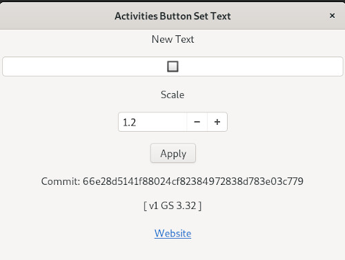

dash-to-panel-activities
========================

The Dash to Panel Activites Text repoistory 

The Dash to Panel extension for the Gnome Shell provides an option to display or 
not display the  Activities Button in the panel. Displaying the word "Activities"
consumes significant space in the panel.

The Dash to Panel Activities Text extension provides a friendly tool to change the
displayed text and scale it when the the Dash to Panel extension is installed.

An emoji can be entered and scaled to provide an "icon" to replace the text. This
extension's default text is 🔲 Black Square Button from <https://emojipedia.org/>.
The emoji 🔲 consumes one character of the panel.

To change the text enter the new text, set the desired scaling and click the Apply
button.

=================================================================================

